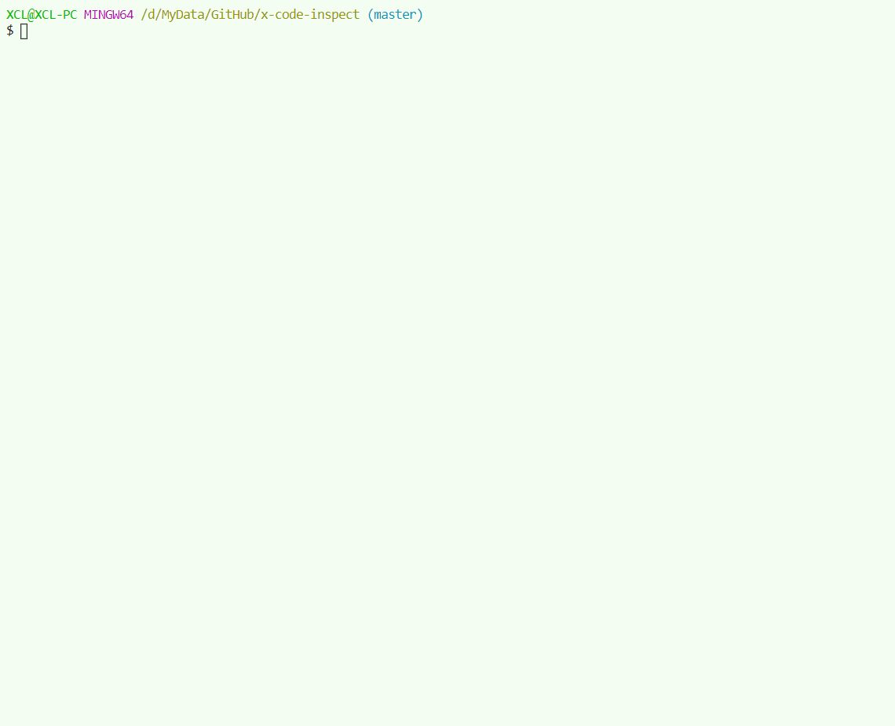

# Introduction

This is a package for checking JavaScript projects. You only need to install this package to use detection tools such as ESLint. Most importantly, you don't need to do extra ESLint configuration, just use the built-in default configuration.

# Why use it

- You don't set up common code checking tools for every project
- Zero configuration
- Keep project style the same

# Usage

- Open your project.

- Remove the configuration files about `ESLint` and `Prettier` from project, because you no longer need them and this tool will creates them automatically.

- `npm i --save-dev --save-exact x-code-inspect@latest`

- Add a script in `package.json`

  ```bash
  "check":"x-code-inspect"
  ```

- `npm run check`

# Preview



# Environment

- Node.js >= 10.13.0

# Built-in Inspectors

### project-basic

- File `package.json` must include: `script.start`, `script.build`
- The project must contains directory: `src`, `dist`, `doc`

### x-package-version-strict-check

- [Home Page](https://github.com/xucongli1989/x-package-version-strict-check)

### ESLint

- [Home Page](https://eslint.org/)
- [VS Code Plug-in](https://marketplace.visualstudio.com/items?itemName=dbaeumer.vscode-eslint#review-details)
- [Rules in used](src/config/eslint_light.json)

**Extra plug-ins:** `react`, `jsdoc`

### Prettier

- [Home Page](https://prettier.io/docs/en/index.html)
- [VS Code Plug-in](https://marketplace.visualstudio.com/items?itemName=esbenp.prettier-vscode#review-details)

# CLI Options

##### -V, --version

output the version number

##### --debug

Run as debug. (default: false)

##### --path

Project's path that you want to check. (default: "./")

##### --check-dir

Specify a directory to be scanned by code (e.g. by plug-ins such as ESLint), the default is root value of `--path`. (multiple are separated by `,`). (default: "")

##### --ignore-check-dir

Specify a directory to be no scanned by code (e.g. by plug-ins such as ESLint), (multiple are separated by `,`). (default: "")

##### --ignore-plugin

Ignored plugin name list (multiple are separated by `,`), (default: "")

##### --enable-plugin

Enable plugin name list (multiple are separated by `,`), (default: "")

##### --eslint-global

Define global variate, see ESLint's doc. (default: "")

##### --eslint-env

The environment in which the code to be checked is running, see ESLint's doc. (default: "amd, browser, commonjs, commonjs, es6, node")

##### -h, --help

output usage information

# Change Log

[CHANGELOG.md](CHANGELOG.md)
